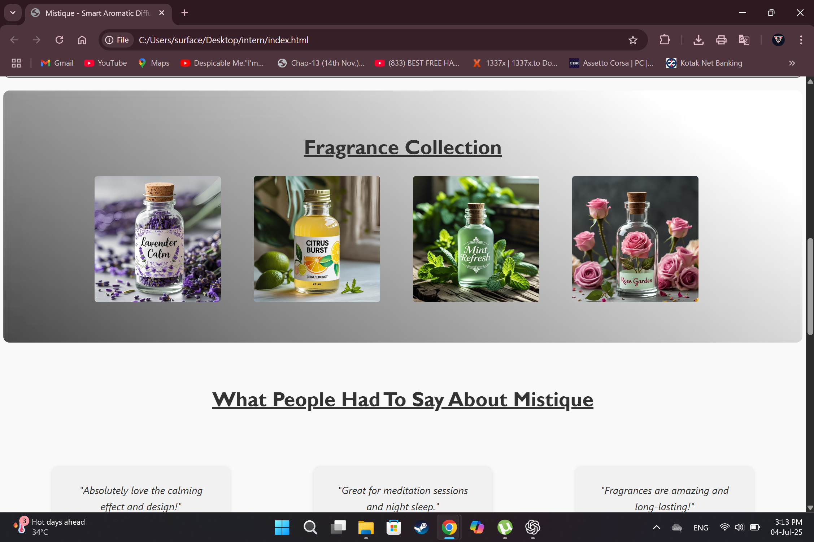
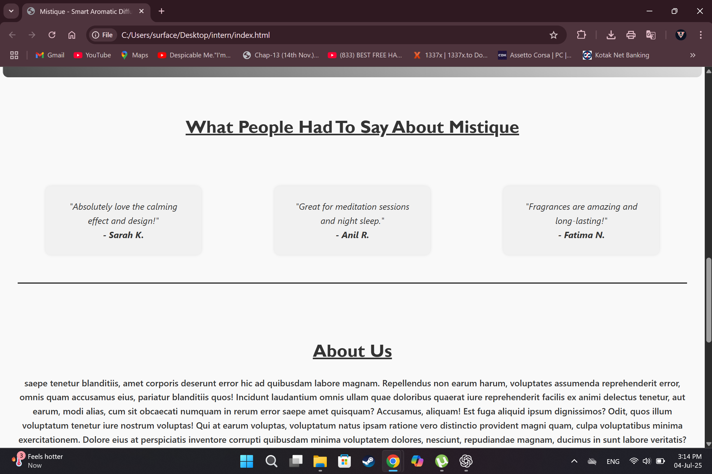
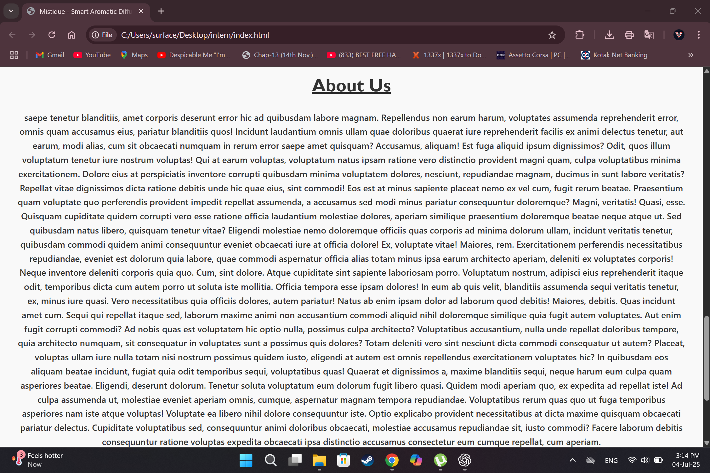
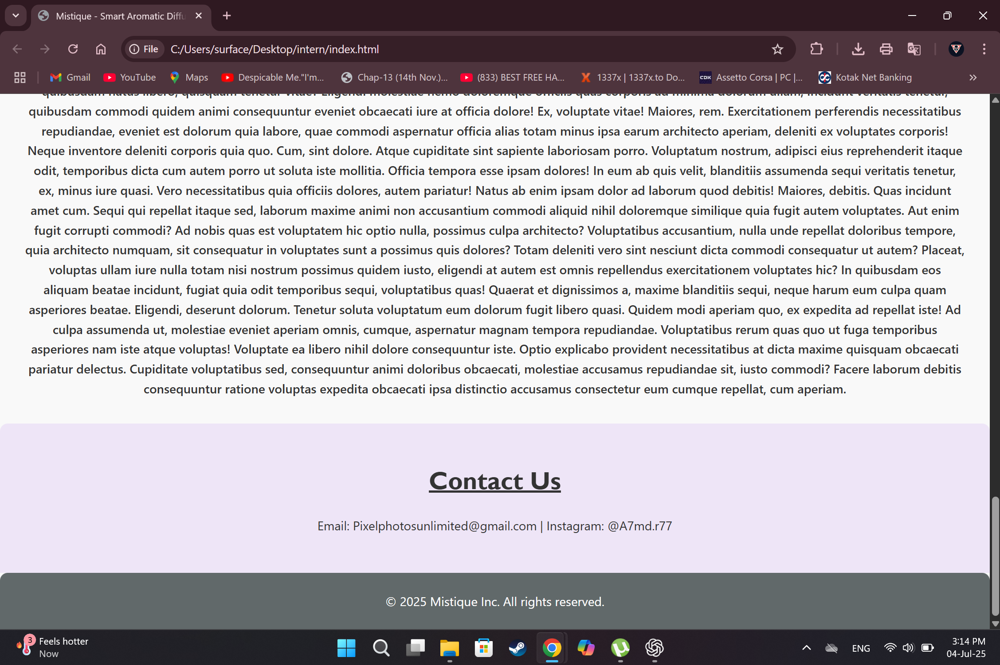

# Landing Page Project – OctaNet Internship

This repository contains a simple **landing page** built using **HTML** and **CSS**. The project was completed as part of my internship with **OctaNet**.

## 📌 About the Project

- 🔹 **Type:** Internship project (OctaNet)
- 🔹 **Tech Stack:** HTML, CSS
- 🔹 **Topic:** Random (open-ended)
- 🔹 **Responsiveness:** Not required (no JavaScript used)

The goal was to design a visually appealing landing page for a random topic using basic web development skills. Since responsiveness wasn’t a requirement, the project focuses purely on layout and styling without using JavaScript or media queries.

## 📁 Project screenshots

  
  

  
  

                 

